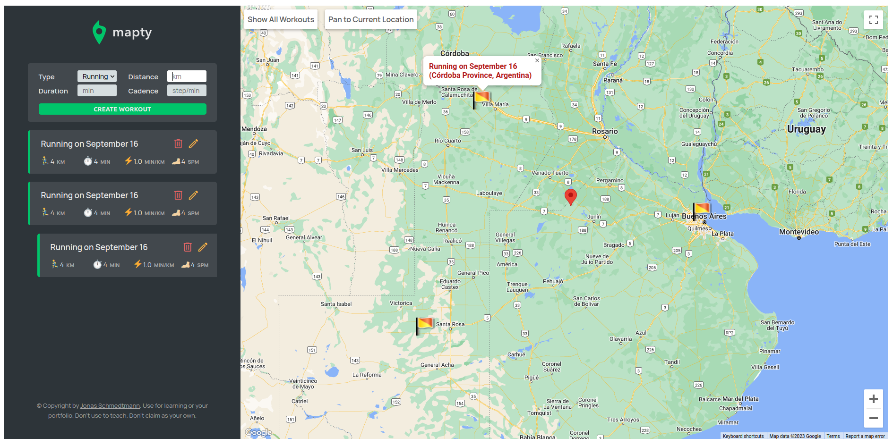

# Mapty: Map your Workouts

## Mark yours running/cycling workouts on a map
### Keep a trak of all your workouts around the world

## Check it out

Open [https://mapty01.netlify.app/](https://mapty01.netlify.app/) to run the app in the browser

## Techologies

- Google Maps API
- Reverse Geocoding API
- Marker Cluesterer API
- JavaScript (Delegation design)
- Parcel as bundler

## Run in development mode

Run the following command in the directory of the project, this will setup a
development server in your localhost

```
npm run start
```

Open [http://localhost:1234](http://localhost:1234) to see it in action.


